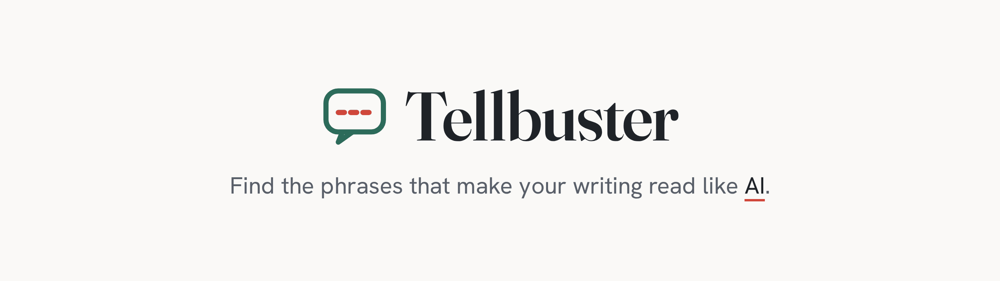
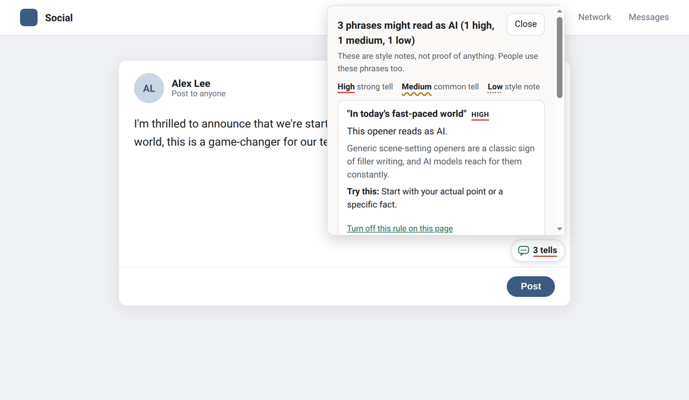

<h1 align="center">
  <picture>
    <source media="(prefers-color-scheme: dark)" srcset="docs/media/banner-dark.png">
    
  </picture>
</h1>

  
  
  
  

  <a href="https://aiprofitwire.github.io/tellbuster/"><b>Try it in your browser</b></a> ·
  <a href="#get-it">Install</a> ·
  <a href="CONTRIBUTING.md">Add a rule</a> ·
  <a href="https://github.com/aiprofitwire/tellbuster/issues/new?template=false-positive.yml">Report a wrong flag</a>

**Find the phrases that make your writing sound like AI.** Free, open source, and nothing leaves your device.

<!-- tellbuster-disable-next-line -->
Tellbuster points out "AI tells": phrases like "Let's delve into", "It's not X, it's Y" or "In today's fast-paced world" that readers now link to machine writing. For each one it explains why it stands out and suggests a plainer way to say it.

> Tellbuster is a linter, not a detector. It never claims your text "is AI". People use these phrases too. It shows you what readers notice, so you can decide.

  

## Get it

| Piece | What it does | Get it |
|---|---|---|
| Web demo | Paste text, see the tells. Nothing to install. | [Open the demo](https://aiprofitwire.github.io/tellbuster/) |
| Browser extension | Check text in a popup, from the right-click menu, or as you type on LinkedIn, X, Gmail and most sites | Coming soon to the Chrome Web Store, Edge Add-ons and Firefox Add-ons. [Try it now from this repo](packages/extension/README.md#try-it-without-the-chrome-web-store) |
| `tellbuster` on npm | The rule engine, for developers to use in their own tools | `npm install tellbuster`. [How to use it](packages/core/README.md) |

The extension works in **Chrome**, **Edge** and **Firefox** (version 140 or newer). **Brave**, **Opera**, **Vivaldi** and **Arc** run Chrome extensions, so they install it from the Chrome Web Store too. Safari is not supported yet.

It checks English and French, with more than 100 rules in all, plus small starter sets for Spanish, German and Portuguese. You can turn off any rule, and add a strict mode for common filler words.

## Private by design

- No servers, no accounts, no tracking. Read the [privacy policy](https://aiprofitwire.github.io/tellbuster/privacy.html).
- Your text is checked on your own device and never sent anywhere.
- The extension asks for no website access when you install it. Only if you turn on **Check as I type** does it ask to read the sites you visit, so it can check what you type in text boxes. It never sends or saves that text. See [the extension's README](packages/extension/README.md#permissions).
- The rules are plain, readable data in [`rules/`](rules/). No hidden AI model making guesses.

## Publishing

The steps to put Tellbuster on npm, the Chrome Web Store, Edge Add-ons and Firefox Add-ons are in [docs/PUBLISHING.md](docs/PUBLISHING.md).

## Help build the list

Spotted a tell we miss? Adding one takes a few minutes and no real coding. See [CONTRIBUTING.md](CONTRIBUTING.md). Native speakers of Spanish, German, Portuguese or any other language are very welcome.

## Credits

Rule ideas were inspired by these MIT-licensed projects, which help AI agents write with fewer tells. Tellbuster brings the same idea to people, in the browser. Rules are written in our own words.

- [stop-slop](https://github.com/hardikpandya/stop-slop) by Hardik Pandya
- [no-ai-slop](https://github.com/petergyang/no-ai-slop) by Peter Yang

## License

MIT. See [LICENSE](LICENSE).

Built by [The AI Profit Wire](https://metadatamarketer.com).
